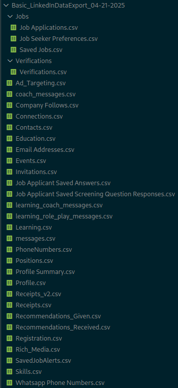

## Curriculum Automático a partir de los datos de Linkedin.


---


<p style="width: 100%"><em><b>Figura 1:</b> Muestra de los datos extraídos de LinkedIn.</em></p>

## Quickstart
#### Exportá tus datos de LinkedIna `.csv`
1. Exportar la data de tu perfil en Linkedin.
2. `Click en tu imágen > Ajustes y privacidad`.
3. `Privacidad de datos > Obtener una copia de tus datos`.
4. Click en "Descarga un archivo de datos más grande,...
5. Esperás un par de minutos/horas, y en el mismo lugar podés descargar los datos.
6. Poner dentro de `data/` y extraer.


#### Crear y editar el `.env`.
```bash
cp .env.example .env
```


#### Ejecutar el script.
```bash
# El CV se guarda en `data/`.
python3 main.py
```
