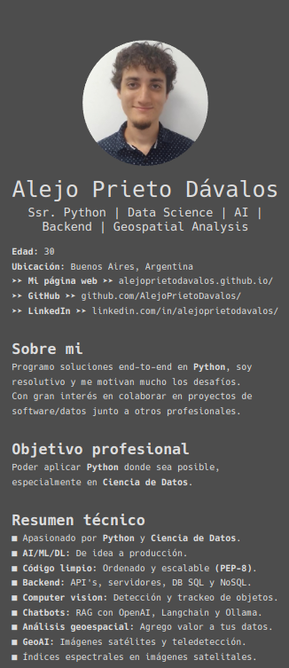

## Curriculum Automático a partir de los datos de Linkedin.



## Como usar
1. Exportar la data de tu perfil en Linkedin.
2. `Click en tu imágen > Ajustes y privacidad`.
3. `Privacidad de datos > Obtener una copia de tus datos`.
4. Click en "Descarga un archivo de datos más grande,...
5. Esperás un par de minutos/horas, y en el mismo lugar podés descargar los datos.
6. Poner dentro de `data/` y extraer.
7. Ejecutar el script, se exporta el pdf dentro de `data/`.

```bash
python3 main.py
```